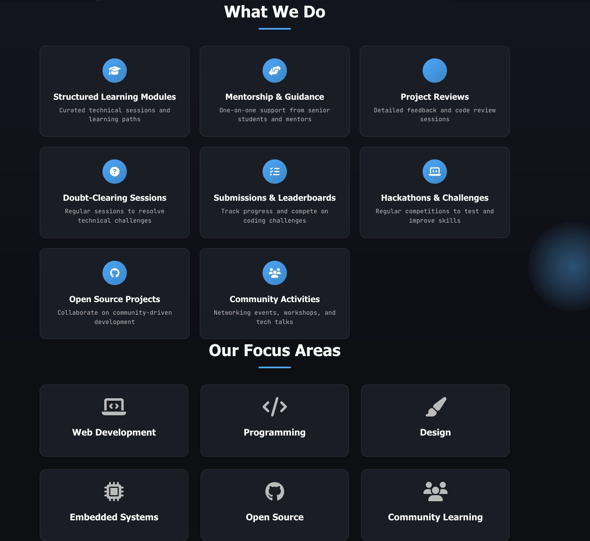

# Pixel Phantoms – Official Website 👻


<div align="center">


[](https://github.com/sayeeg-11/Pixel_Phantoms/blob/main/CONTRIBUTING.md)
[](https://github.com/sayeeg-11/Pixel_Phantoms/blob/main/LICENSE)
[](https://opensource.org/)

## A beginner-friendly, responsive, open-source platform for learning and collaboration
</div>

## 📋 Table of Contents

- 🎯[ Project Overview](#-project-overview)
- 🌟[ Why This Project Matters](#-why-this-project-matters)
- 🛠[ Tech Stack](#-tech-stack)
- 📦 [Installation & Local Setup](#-installation--local-setup)
- 🔧[ Code Formatting & Linting](#-code-formatting--linting)
- 🤝 [How to Contribute](#-how-to-contribute)
- 📁[ Project Structure](#-project-structure)
- 🎨 [Screenshots & Demo](#-screenshots--demo)
- 🗺️ [Project Roadmap](#-project-roadmap)
- 📝[ Issues](#-issues)
- 📌 [License](#-license)
- 👥[ Core Committee (2024–25)](#-core-committee-202425)
- 🔥[ Contributors](#-contributors)
- 📫 [Contact](#-contact)

---

## 🎯 Project Overview

The **Pixel Phantoms Official Website** serves as the central digital hub for the Pixel Phantoms student-driven tech community. This platform not only showcases community initiatives but also functions as a real-world, beginner-friendly open-source codebase for hands-on learning.

### Key Features:
- 📢 Showcases the Pixel Phantoms community and its activities
- 📅 Highlights events, workshops, achievements, and member projects
- 👥 Presents the core committee and recruitment details
- 🎓 Encourages learning, collaboration, and open-source contributions
- 🌐 Fully responsive design for all devices

> **Note:** Open to students, beginners, and open-source contributors worldwide!

---

## 🌟 Why This Project Matters

- 🎯 **Beginner-Friendly Environment** – Perfect for first-time open-source contributors
- 💻 **Hands-On Learning** – Practical experience with modern frontend development
- 🤝 **Collaborative Workflows** – Learn Git, issues, PRs, and code reviews
- 🏗️ **Real-World Structure** – Industry-standard project organization
- 🎨 **UI/UX Development** – Opportunities to enhance design and responsiveness skills

---

## 🛠 Tech Stack

### Core Technologies:
<p >
  
  <strong>HTML5</strong>

  
  <strong>CSS3</strong>
<p>

  
  <strong>JavaScript</strong>
</p>


### Optional Add-ons:
- **Bootstrap** – Responsive framework
- **AOS Animations** – Scroll animations
- **jQuery** – Simplified JavaScript
- **API Integrations** – External data fetching

---

## �️ Event View Tracking

Our events page features a **client-side view counter** that tracks event popularity:

**How It Works:**
- Uses browser **localStorage** for persistent tracking
- Increments when an event card is clicked
- **3-second debounce** prevents spam clicks
- Data persists across browser sessions

**Features:**
- 📊 Per-event tracking with unique IDs
- 🔢 Human-readable formatting (1.2K, 1.5M views)
- 🛡️ Prevents abuse with timestamp checks
- 💾 Works completely offline (no backend required)

**Data Storage Format:**
```json
{
  "event-1": {"count": 123, "lastView": 1234567890},
  "event-2": {"count": 456, "lastView": 1234567891}
}
```

---

## �📦 How to Install & Run Locally

### Prerequisites

- 🌐 Modern web browser (Chrome, Firefox, Safari, or Edge)
- 🐙 **Git** – Required for cloning the repository
- ⚙️ **Node.js (v16+)** and **npm** – For development tooling
- 💡 **VS Code** with Live Server extension (Recommended)

### Step-by-Step Setup

1. **Clone the Repository**
   ```bash
   git clone https://github.com/sayeeg-11/Pixel_Phantoms.git
   cd Pixel_Phantoms
2. **Install Dependencies (Recommended for contributors)**
    ```bash
    npm install
**Run the Website Locally**

✅ Option 1: Live Server (Recommended)

Open project in VS Code

Right-click index.html

Select "Open with Live Server"

Access at  **http://127.0.0.1:5500/**

⚠️ Option 2: Direct Browser Access

Open index.html directly in browser

Note: Some JavaScript features may not work due to CORS

<hr>

## 🔧 Code Formatting & Linting
This project uses automated tools to maintain code quality:
**Available Commands:**
```bash
# Formatting

npm run format          # Format all files
npm run format:check    # Check formatting without changes

# Linting
npm run lint           # Check for linting issues
npm run lint:fix       # Fix linting issues automatically
```

**Pre-commit Hooks:**

🛡️ Husky and lint-staged automatically run checks before commits

🔒 Commits are blocked if formatting/linting checks fail

✅ Ensures consistent code quality across all contributions

<hr>

## 🤝 How to Contribute
We welcome all contributions – design updates, animations, UI fixes, new pages, and more!

**Contribution Workflow:**

Before Starting:

Create an Issue describing your proposed change

Wait for admin to assign the issue to you

Discuss implementation details if needed

**Development Steps:**

```bash
# 1. Fork the repository
# 2. Clone your fork
git clone https://github.com/your-username/pixel-phantoms-website.git

# 3. Create feature branch
git checkout -b feature-name

# 4. Make changes and commit
git commit -m "Add: short feature description"

# 5. Push to your fork
git push origin feature-name
```
**Submit Pull Request:**

Open a Pull Request from your branch

Reference the related issue

Wait for review and feedback

**👉 Detailed guidelines: CONTRIBUTING.md**
<hr>

<details>

<summary>
  <h2> 📁 Project Structure</h2>
  <p>Click to view the project structure</p>
</summary>


```
pixel-phantoms-website/
│
├── index.html
├── about.html
├── contact.html
├── team.html
├── events.html
├── CODE_OF_CONDUCT.md
├── CONTRIBUTING.md
├── LICENSE
├── README.md
│
├── assets/
│   ├── demo.png
│   ├── host-event.jpg
│   └── logo.png
│
├── css/
│   ├── style.css
│   ├── home-gsap.css
│   ├── back-to-top.css
│   ├── community.css
│   ├── contact.css
│   ├── contributors.css
│   ├── events.css
│   ├── gallery.css
│   ├── help.css
│   ├── join-us.css
│   ├── privacy.css
│   ├── projects.css
│   └── terms.css
│
├── data/
│   └── events.json
│
├── js/
│   ├── back-to-top.js
│   ├── community.js
│   ├── contact.js
│   ├── contributors.js
│   ├── events.js
│   ├── footer.js
│   ├── gallery.js
│   ├── help.js
│   ├── home-gsap.js
│   ├── home-leaderboard.js
│   ├── join-us.js
│   ├── main.js
│   ├── navbar.js
│   ├── privacy.js
│   ├── projects.js
│   ├── scripts.js
│   ├── terms.js
│   └── theme.js
│
└── pages/
    ├── community.html
    ├── contributors.html
    ├── gallery.html
    ├── help.html
    ├── join-us.html
    ├── privacy.html
    ├── projects.html
    └── terms.html
```
</details>

<details>
  <summary>
    <h2>🎨 Screenshot / Demo</h2>
    <p>Click to view screenshots of the Pixel Phantoms website</p>
  </summary>

  <br/>

  <h3>🏠 Home Page</h3>
  

  <hr/>

  <h3>🪪 Logo</h3>
  

  <hr/>

  <h3>🖼️ Additional Images</h3>

  <p align="center">
    
    
    
  </p>

  <p align="center">
    
    
    
  </p>

</details>


---

## 🗺️ Project Roadmap

✅ Completed |🚧 In Progress |🔮 Coming Soon
|---|---|---|
Basic UI setup | Events Page | Dark / Light mode
Home, About, Contact pages | Projects showcase | Blog section
Core committee section | Mobile responsiveness improvements | Student portfolio integration
Navbar & footer components| |

---

## 📝 Issues

Found a bug?
Have an idea?
👉 Open an **Issue** with the correct labels.

---

## 🔧 Page Transitions (Issue #519)

We've added an optional, performant page transition system using CSS + Vanilla JS to improve navigation UX across the site.

Highlights:
- Fade + subtle slide transitions (300ms default)
- Respects users' prefers-reduced-motion setting
- Works without JS (graceful degradation)
- Optional loading indicator for slow fetches

Files added/updated:
- `css/animations.css` (new)
- `js/page-transitions.js` (new)
- Updated page wrappers: `index.html`, `about.html`, `contact.html`, `events.html`, `pages/*.html`
- Init added to `js/main.js`

To customize: change `--page-transition-duration` in CSS or pass options to `PageTransitions.init({ duration, type, scrollToTop, showLoadingIndicator })`.

---

## 📌 License

This project is licensed under the **MIT License**.
See the full license in the [`LICENSE`](LICENSE) file.

---
<details>

<summary>
  <h2>🧑‍💻 Core Committee</h2>
  <p>Click to view the committee for the batch 2024-25</p>
</summary>

* **Director:** Prathamesh Wamane
* **President:** Krishna Shimpi
* **Vice President:** Pratik Thorat
* **Technical Head:** Harsh Pawar
* **Treasurer:** Ayush Patil
* **Event Head:** Laxmi Shingne
* **Project Manager:** Krushna Gite
* **Recruitment Head:** Pallavi Thote
* **Web Development Lead:** Pushkar Thakare
* **Design Head:** Shruti Gaikwad
* **Embedded System Lead:** Diksha Rakibe
* **Social Media & Branding Head:** Rushabh Pekhale
* **Media & Publicity Head:** Sarvesh Aher
* **Mentors:** Sayee Gosavi, Mohit Jagtap

</details>

---

## � GitHub Integration

The contributors page now features **live GitHub integration** to showcase team member activity and contributions!

### 📊 Contributor Stats
- **Public Repos:** Displays total public repositories
- **Followers & Following:** Shows GitHub network stats
- **Cached Data:** Results cached for 24 hours in localStorage
- **Rate Limiting:** 60 API requests/hour (unauthenticated)
- **Graceful Fallbacks:** Shows cached data if API limits are exceeded

### 📈 Contribution Graph
- **Yearly Heatmap:** Powered by [github-calendar](https://github.com/IonicaBizau/github-calendar) library
- **Responsive Design:** Mobile-friendly contribution visualization
- **Activity Insights:** See daily contribution patterns at a glance

### 🔧 Adding New Contributors
To display GitHub stats for a contributor:
1. Add `data-github="username"` attribute to contributor card
2. Replace `username` with their actual GitHub username
3. Stats will automatically populate on page load

```html
<div class="contributor-card" data-github="SujalTripathi">
  <!-- Stats auto-populate here -->
</div>
```

### ⚡ Technical Details
- Uses **GitHub REST API** (no authentication required for public data)
- Fetches: repos, followers, following, recent projects
- **Error Handling:** Network failures, rate limits, missing profiles
- **Performance:** Parallel API requests with caching strategy

---

## �🔥 Contributors

Thanks to all the amazing contributors who make this project better every day! 💖

<a href="https://github.com/sayeeg-11/Pixel_Phantoms/graphs/contributors">
  
</a>

**👉 See the full [contribution graph](https://github.com/sayeeg-11/Pixel_Phantoms/graphs/contributors)**  


---

## 📫 Contact

**Admin:**  
**Sayee Gosavi**

- 📧 Email: [sayeeygosavi@gmail.com](mailto:sayeeygosavi@gmail.com)
- 💻 GitHub: [sayeeg-11](https://github.com/sayeeg-11)
- 🔗 LinkedIn: [Sayee Gosavi](https://www.linkedin.com/in/sayee-gosavi11/)
- 📍 Location: Nashik, Maharashtra

> Let’s build something amazing together! 🚀👻


### Security: Contact form spam protection

- The contact form includes a hidden honeypot field named `website` (bots often fill this).
- Client-side rate limiting is enabled (5 seconds between submissions) using `localStorage`.
- No server configuration or API keys are required.

**Testing:** Fill the hidden `website` field or submit repeatedly to see the "Spam detected" and rate limit messages.

